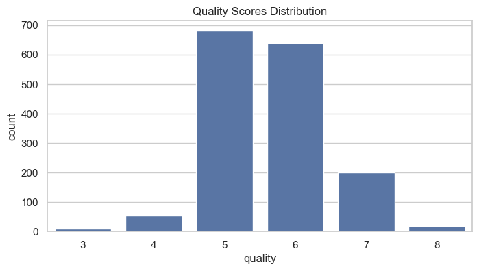
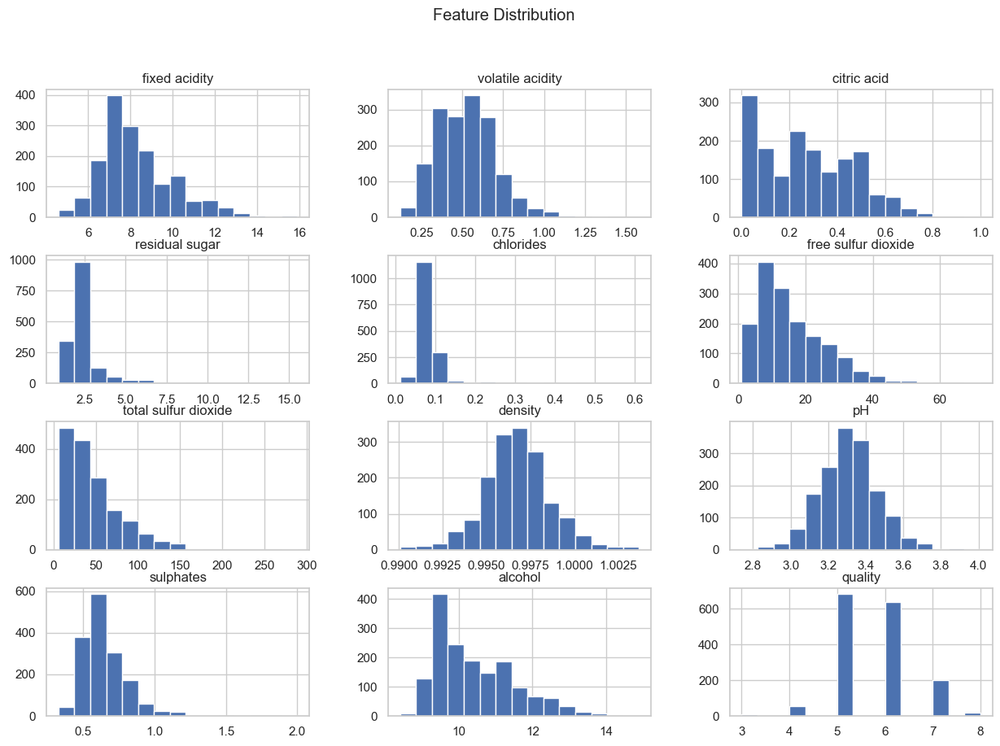
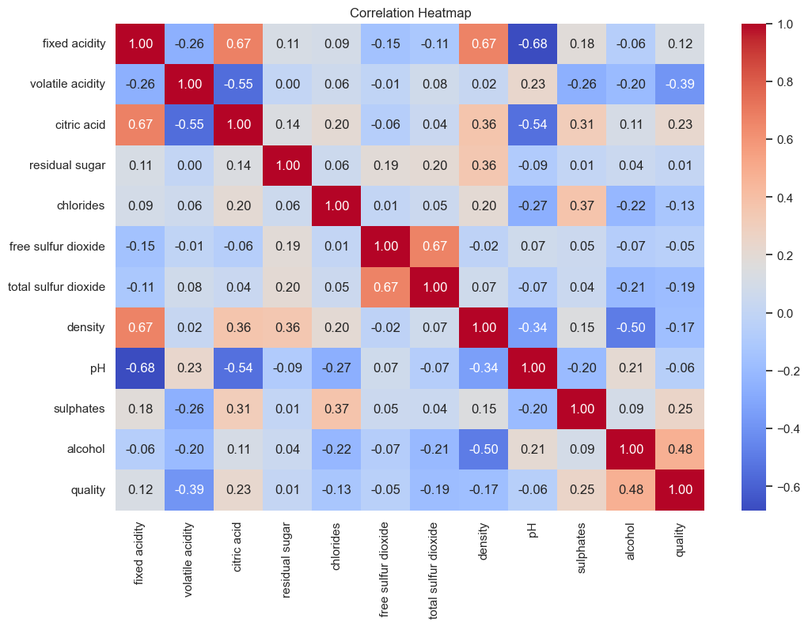
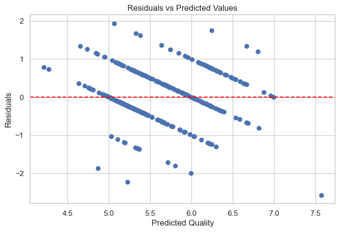
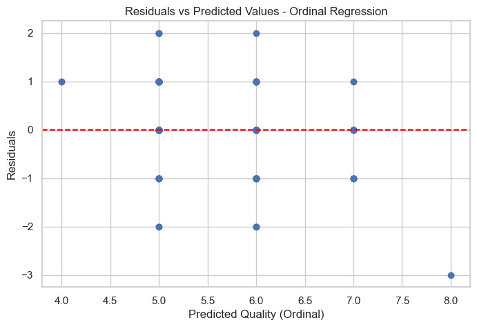
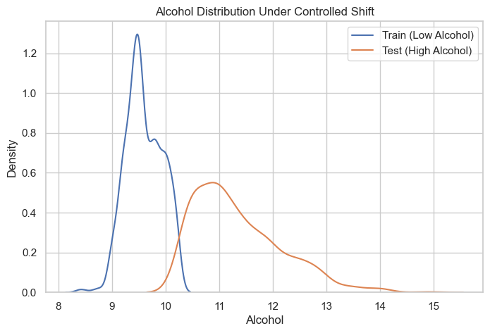
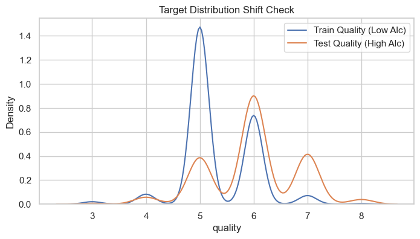
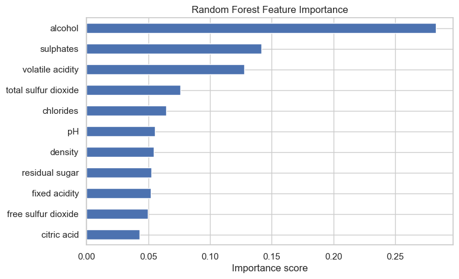
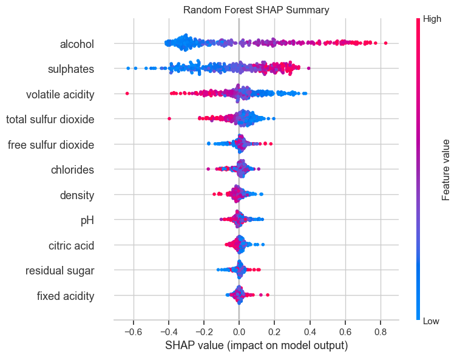
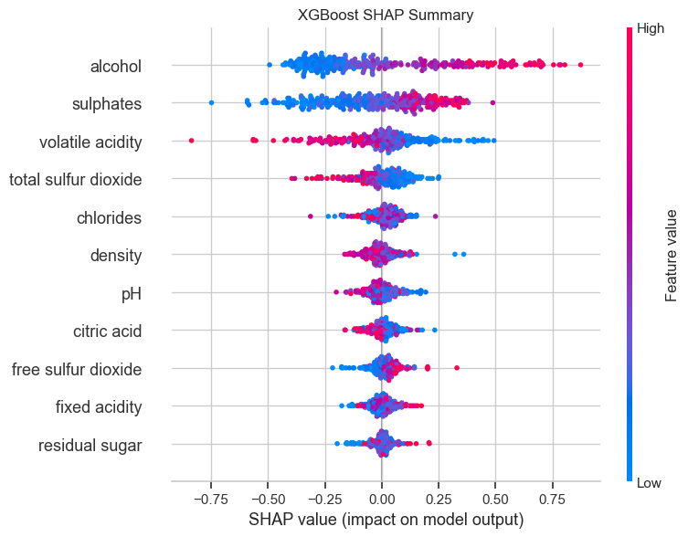

# Comparative Statistical and ML Analysis of Red Wine Quality
Exploratory analysis and predictive modeling of wine quality using linear, ordinal, tree-based, and XGBoost models with cross-validation and SHAP interpretation.

## Introduction

This project investigates the relationship between the physicochemical properties of red wine and quality ratings using a combination of parametric statistical models and non-parametric machine learning methods. The primary goal of this analysis is to determine if measurable chemical attributes can reliably predict how a wine is rated by human testers.

Predicting wine quality is complex because of the nature of the target variable. Quality scores are discrete, ordered integers that are heavily concentrated around scores 5 and 6. This distribution indicates that the data doesn't fit into a standard regression or classification framework. This analysis evaluates four modeling approaches suited to this structure, compares their performance using appropriate metrics, and stress-tests the two most strongest models with a controlled covariate shift to evaluate their predictive stability.

---

## Dataset

**Source:** UCI Machine Learning Repository — [Wine Quality Data Set](https://archive.ics.uci.edu/ml/datasets/wine+quality), Cortez et al. (2009).

The dataset contains 1,599 red wine samples. Each sample is described by 11 chemical features including alcohol content, volatile acidity, and sulphates. A key challenge in this project was addressing the significant class imbalance. Most wines are rated as 5 or 6, while scores at the extremes (3, 4, 7, and 8) are sparsely represented. I accounted for this distribution explicitly in the preprocessing and validation section.



---

## Exploratory Data Analysis

During initial data exploration, I observed that several features exhibit a meaningful right skew and contain notable outliers. This is particularly evident in residual sugar, chlorides, sulphates, and sulphur dioxide. I retained these outliers as they represent real variations in wine chemistry. Additionally, the tree-based models used are naturally robust to these distributions.



The correlation analysis shows that alcohol has the strongest postive relationship with quality. Conversely, volatile acidity has the strongest negative correlation. Also noted are moderate positive associations with citric acid and sulphates. 

---

## Statistical Diagnostics and Methodology

### Multicollinearity (VIF)

Before splitting the data, Variance Inflation Factors (VIF) were calculated across all features to identify potential multicollinearity. To ensure accuracy of the diagnostics, I added a constant intercept to the design. The results showed elevated VIF scores for features like fixed acidity and density, which indicates that these variables are highly correlated. These dependencies suggest that linear regression coefficents should be interpreted cautiously, as the estimates will be unstable and standard errors will be inflated. For the ensemble models used later, multicollinearity is not a concern due to tree-based models splitting on individual features resulting in them being unaffected by linear dependencies among predictors. 



### Modeling Ordinality

Wine quality is measured on an ordered integer scale (3–8). Treating it as a purely continuous ignores its discrete structure, while treating it as unordered categories loses the established ranking. Ordinal Regression is included as a methodologically sound middle ground. By treating quality as a series of thresholds, this model aligns more closely with the ordered structure without forcing a continuous prediction.

---

## Modeling Methodology

### Preprocessing 

StandardScaler was utilized within a Scikit-Learn Pipeline for the parametric models. This ensured that the scaling was fit exclusively on the training data during cross-validation, which prevented the risk of data leakage. Tree-based models (Random Forest, XGBoost) do not require scaling and were trained directly on raw features. 

### Validation 

To handle the class imbalance, a Stratified K-fold cross-validation was employed to ensure that every fold contained a representation of the less common quality scores. The same stratification logic was applied to the train/test split via `stratify=y`.

### Models

| Model | Type | Rationale |
|---|---|---|
| Linear Regression | Parametric, continuous | Interpretable baseline and establishes the linear ceiling |
| Ordinal Regression (`mord` LogisticAT) | Parametric, ordinal | Methodologically suited to ordered integer targets |
| Random Forest | Non-parametric ensemble | Handles non-linearity and multicollinearity |
| XGBoost | Gradient boosted ensemble | Regularized boosting and strong generalization performance |

---

## Model Evaluation

### Performance Summary

| Model | Test RMSE | Test MAE | Test R² | CV R² Mean | CV MAE Mean | R² Drop (Shift) |
|---|---|---|---|---|---|---|
| Linear Regression | 0.671 | 0.517 | 0.303 | 0.348 | — | — |
| Ordinal Regression | — | 0.459 | — | — | 0.437 | — |
| Random Forest | 0.589 | 0.412 | 0.463 | 0.5 (±0.031) | — | 0.461 |
| XGBoost | 0.601 | 0.390 | 0.441 | 0.478 | — | 0.507 |

**Key findings:**

- *Linear Regression* achieves an R² of approximately 0.35 in cross-validation. This confirms that while wine quality contains meaningful signal, it also contains a non-linear structure that a linear model cannot fully capture. The residuals versus fitted plot reveals clear bias and heteroscedasticity, which suggests systematic model misspecification.



- *Ordinal Regression* achieves a lower Mean Absolute Error (MAE) than the standard linear model, suggesting it better respects the ordered distance between quality categories. Because this is a classification-based approach, R² isn't calculated. Instead, the analysis focuses on MAE as a better match for the target structure. 



- *Random Forest* outperforms linear models on all regression metrics, with an R² of 0.50 and the lowest RMSE (0.589). Cross-validation scores track closely with test scores, indicating no significant overfitting in the model.

- *XGBoost* achieves a slightly lower R² than Random Forest but produced a lower Test MAE of 0.390. This result implies that XGBoost predictions tend to land closer to true scores on average. The inclusion of L1 and L2 regularization maintains stable generalization, and a `max_depth` of 5 was chosen to balance model complexity against the risk of overfitting.

Both tree-based models were further evaluated using `RandomizedSearchCV` to determine whether default hyperparameters were already near-optimal. The Random Forest model saw a marginal improvement in cross-validation R², moving from 0.496 to 0.500 (+0.004). Similarly, the XGBoost model saw an improvement from a baseline R² of 0.459 to 0.478 (+0.019). 

---

## Robustness & Stress Testing

### Experimental Design
To evaluate how these models might perform in a real world environment, I stress tested them with a controlled covariate shift. 
The models were trained exclusively on low alcohol wines and were tested on high alcohol wines. Alcohol was chosen as the split variable because it is the most predictive feature, making it the most meaningful stress test for assessing model generalization. Both models showed a significant performance drop under this shift. 



### Target Drift Diagnostic

The low alcohol training group has a mean quality of 5.324, compared to 5.983 in the high-alcohol test group, a difference of 0.659 points. This matters because the models were trained on a quality distribution they had limited exposure to during training. 

The resulting R² drop under the shift can be attributed to a combination of covariate shift and target drift, and shouldn't be interpreted as simply a failure of the model architecture



### Results

| Model | Original R² | Shifted R² | R² Drop |
|---|---|---|---|
| Random Forest | 0.462 | 0.002 | 0.461 |
| XGBoost | 0.441 | -0.066 | 0.507 |

Both models show substantial R² degradation under the shift. This is expected given alcohol's dominant predictive weight. When the alcohol distribution changes, the learned associations lose their relevance.

The Random Forest R² entirely collapsed, dropping to just 0.002, and the XGBoost R² fell to below zero. An R² value of less than zero indicates performance worse than predicting the mean. Additionally, the Random Forest RMSE increased from 0.589 to 0.830, representing a 41% increase in out-of-sample prediction error.

These results demonstrate that while tree-based ensemble models perform well under IID assumptions, they are highly sensitive to structural shifts in the dominant predictive feature. This highlights that even with strong cross-validation performance, robustness is not guaranteed under distribution shift.

---

## Feature Importance 

Both Random Forest and XGBoost have built-in feature importance scores. These rankings identify which features matter most to the model, but not how they actually affect predictions. 

Alcohol and sulphates are the top ranked features in both models, with volatile acidity as a secondary contributor.




## Interpretability

SHAP (SHapley Additive exPlanations) values were computed for both ensemble models to better understand the contributions of each feature. 
Across both Random Forest and XGBoost:
- *Alcohol* showed the strongest positive effect, elevating the predicted quality
- *Volatile Acidity* showed a strong negative effect
- *Sulphates* had a moderate postive effect

The consistency of the SHAP patterns across two different model families and importance methods strengthens confidence that these are genuine data patterns rather than modeling artifacts.






---

## Limitations 
Distribution shift conflates two effects. The alcohol split design simultaneously introduces both covariate shift and target drift. A cleaner robustness test, like resampling the high alcohol test set to match the original training quality distribution, would hold the quality distribution constant while only shifting the feature distribution.

There is also a moderate predictive ceiling. The highest R² achieved is 0.50. Since the quality rankings are assigned based on human tasters, there is a level of inherent subjectivity, which creates a predictive error floor that a model cannot account for.

In this analysis, only red wine was evaluated. Without retraining, it cannot be determined if these models generalize well enough for white wines, which typically contain have different chemical profiles and acidity balances.

There is also an absence of feature engineering: No interaction terms or polynomial features were examined. Ratios like the free-to-total sulfur dioxide ratio or the volatile-to-fixed acidity ratio could potentially capture chemical interactions that individual features do not. 

---

## Reproducibility

**Libraries:** pandas, numpy, scikit-learn, xgboost, mord, shap, matplotlib, seaborn, statsmodels

All random operations use `random_state=123`. Dataset available from the [UCI ML Repository](https://archive.ics.uci.edu/ml/datasets/wine+quality).

```bash
pip install pandas numpy scikit-learn xgboost mord shap matplotlib seaborn statsmodels
```


